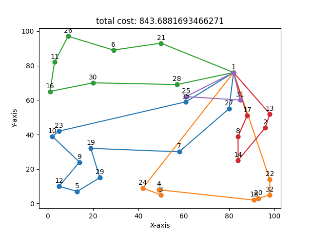
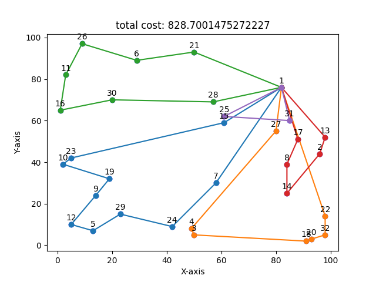
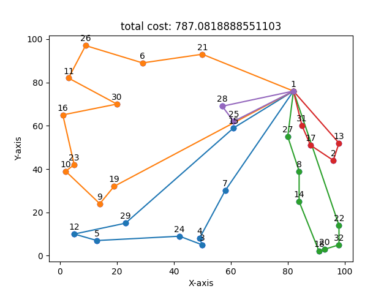

## Dataset
http://vrp.galgos.inf.puc-rio.br/index.php/en/

## Documentation
CW: https://web.mit.edu/urban_or_book/www/book/chapter6/6.4.12.html <br>
ICW: https://www.scienceasia.org/2012.38.n3/scias38_307.pdf

## Getting Started
<b>Step 1:</b> Run the Algorithm
To execute the algorithm, run the following command in your terminal:
```
node main.js
```

<b>Step 2:</b> Visualize the Solution
To display an illustrative graph of the answer, use the following Python command:
```
python graph.py
```
Make sure you have Node.js and Python installed on your system before running the commands. Adjust the file names or paths according to your project structure.

## Repo branch
### main
The `main` branch contains the implementation of the Improved Clarke-Wright Savings algorithm.
### CW
The `CW` branch includes the implementation of the Clarke-Wright Savings (CW) algorithm in its classical form.
### Vigo
The `Vigo` branch extends the CW algorithm by incorporating the Vigo heuristic parameter.

## Result
#### <ul>With A-n32-k5 dataset</ul>
<li>Clarke-Wright Savings</li>
<p align="center">
  
</p>
<br>
<li>Vigo's Heuristic</li>
<p align="center">
  
</p>
<br>
<li>Improved Clarke-Wright Savings</li>
<p align="center">
  
</p>